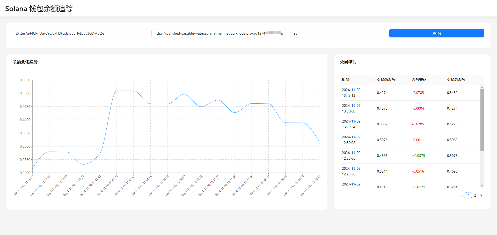

# SOL Balance Tracker

一个用于追踪 Solana 钱包 SOL 余额变化历史的工具。

## 功能特点

- 获取钱包最近100笔交易记录
- 计算每笔交易前后的 SOL 余额变化
- 生成详细的交易记录和余额变化数据
- 可视化展示余额变化趋势

### 截图演示

以下是应用程序的可视化图表示例：



## 安装

1. 克隆仓库
```bash
git clone https://github.com/ranxi2001/sol-balance-tracker.git
cd sol-balance-tracker
```

2. 安装依赖
```bash
npm install
```

3. 配置环境变量
创建 `.env` 文件并填入以下内容：
```plaintext
SOLANA_RPC_URL=你的_SOLANA_RPC_URL
WALLET_ADDRESS=你的钱包地址
```

## 使用方法

1. 获取余额历史数据
   ```bash
   node index.mjs
   ```

2. 启动 HTTP 服务器：
   ```bash
   python -m http.server 8000
   ```
   在浏览器中访问 [http://localhost:8000](http://localhost:8000)

3. 查看可视化图表
   ```bash
   open index.html
   ```

## 输出文件

- `detailed_transactions.json`: 包含详细的交易记录
- `balance_data.json`: 包含处理后的余额变化数据

## 依赖项

- @solana/web3.js
- moment
- node-fetch
- dotenv
- chart.js

## 注意事项

- 需要有效的 Solana RPC URL
- 建议使用 Node.js 16+ 版本
- 确保钱包地址格式正确

- License： `MIT`

